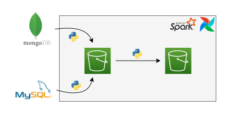

# data-lake-solution
A solution to create a Data Lake.

In this scenario we've two database in application, the sales database is on MySQL and the users database in on MongoDB. 
 
We need to transfer the data from both of databases to a Data Lake, then this data can be used by Data Analytics and Science, or who needs to use it.

In this projet we shall use two methods to make this transfer, via Batch and via Streaming.

### Batch

### Streaming

