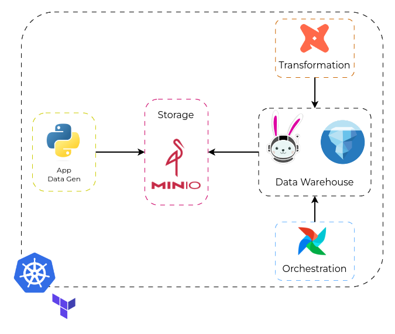

# data-lake-solution

### Architecture

### Infra
All the resources needed to create a Kubernetes cluster as well the complete Platform
for the data environment using - or not - GitOps.

For environment deployment:
1. [Kubernetes](https://github.com/matbragan/data-lake-solution/tree/main/infra/kubernets)
2. [GitOps](https://github.com/matbragan/data-lake-solution/tree/main/infra/argocd)
3. [Platform](https://github.com/matbragan/data-lake-solution/tree/main/infra/platform)

### App
Development of an application that creates json or parquet files to place in the landing zone folder of a Data Lake, in this case using MinIO (s3).

1. [Data Gen DataStores](https://github.com/matbragan/data-lake-solution/tree/main/app/data-gen-datastores)

### Data
Creating a data pipeline using Apache Airflow, Trino & dbt-Core to create a complete end-to-end data environment.

To build the data environment, follow the steps:
1. [Trino](https://github.com/matbragan/data-lake-solution/tree/main/data/sql)
2. [dbt-Core](https://github.com/matbragan/data-lake-solution/tree/main/data/dags/dbt/lake)
3. [Airflow](https://github.com/matbragan/data-lake-solution/tree/main/data/dags/dbt_sql_transform.py)